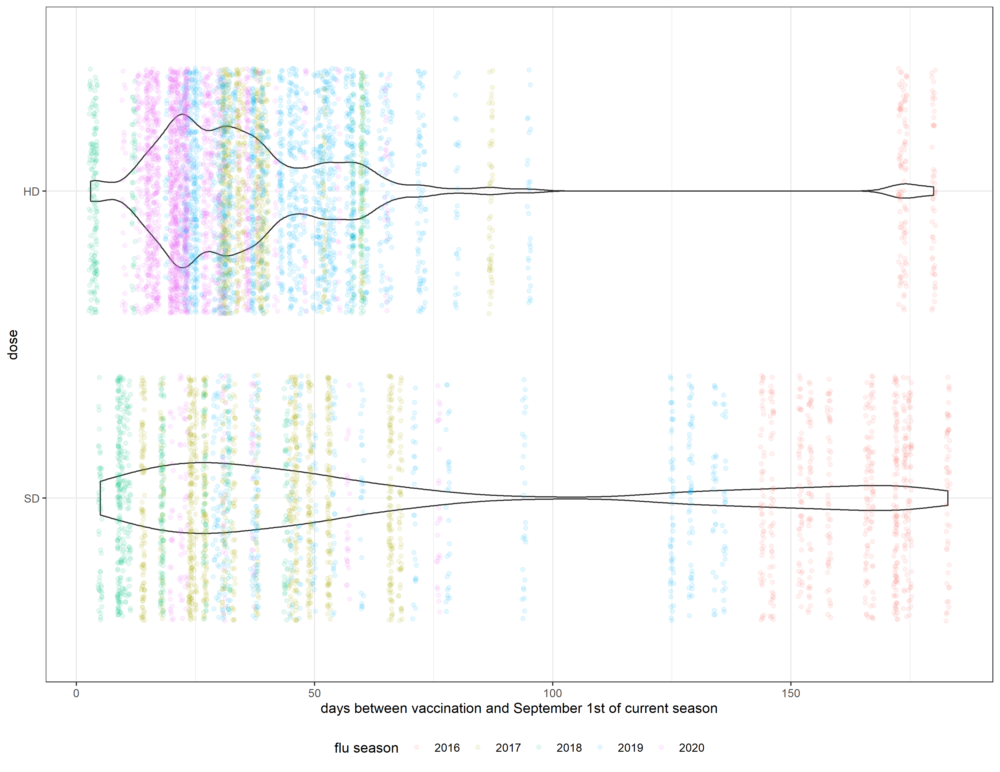
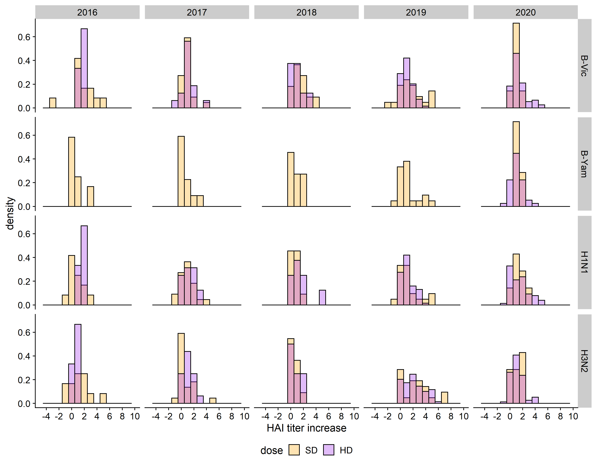
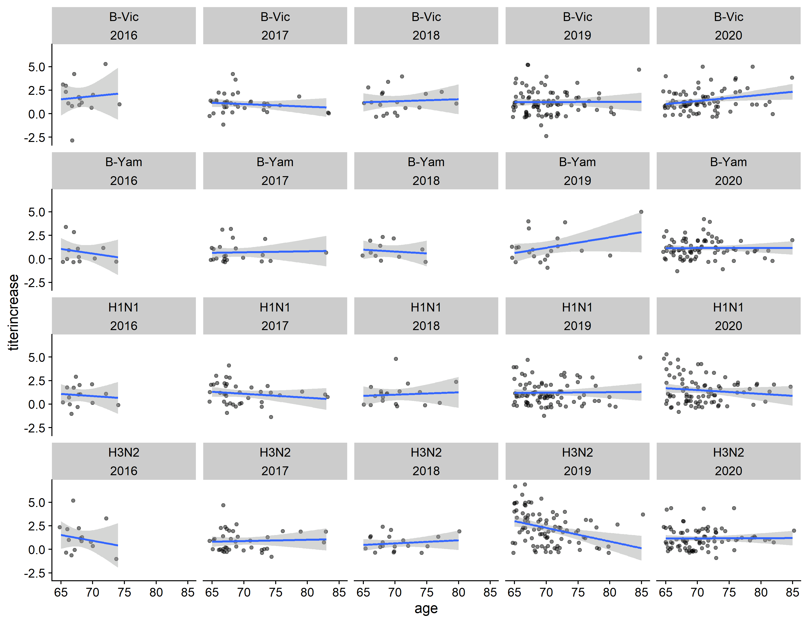

# Summary/Abstract


# Background and Introduction 

While influenza has been well-known for over 100 years and has caused 4 pandemics within that time span, the full scope of the human immune response to influenza viruses remains not fully understood. The difficulty in developing antiviral drugs and vaccines for influenza viruses is partially due to the fast rate of antigenic drift which influenza viruses display. Two major proteins for predicting pathogenicity and immunogenicity of influenza virus are the capsule surface proteins hemagglutinin (HA), which facilitates the viral entry process, and neuraminidase (NA), which facilitates the viral exit process. The genetic sequence encoding the unique properties of variants of these proteins are what give rise to the naming system of influenza A subtypes, e.g. H1N1. Hemagglutinin inhibition (HAI) titer, measured as the lowest of a series of two-fold dilutions at which hemagglutination is observed for a serum sample, is generally accepted by the influenza research community as a correlate of protection from influenza (that is, HAI titer is correlated with the strength of immune response to influenza).

Recent mechanistic modeling of the influenza immune response at the host level [@zarnitsyna_multi-epitope_2016] predicts that fold change in antibody levels after vaccination with a seasonal influenza vaccine will exhibit a negative linear relationship with preexisting antibody levels on a log-log scale, with an additional “threshold” or so-called “antigen ceiling” effect--if the host has a high-enough level of preexisting immunity, there will be no response to the influenza vaccine. This “threshold” can be overcome by increasing the dose of the vaccine.


## Description of data and data source

The data we will use for this project is from an ongoing cohort study of immune response to the seasonal influenza vaccine conducted by Ted Ross at the School of Veterinary Medicine at the University of Georgia. The study design is a prospective, open cohort where a few hundred participants receive either the FluZone, FluZone HD, or FluMist seasonal influenza vaccine each year since 2014. Patients receive a pre-vaccination and a 28-day vaccination blood draw. Hemagglutination inhibition titers are conducted on serum samples for both the homologous strains of influenza included in the vaccine, as well as a wide panel of historical strains. Influenza A strains which are included are from both H1N1 and H3N2 subtypes, and influenza B strains tested against include pre-divergence historical strains, as well as strains from both the Victoria-like and Yamagata-like lineages. Several other host factors including age, sex, BMI, history of vaccine and comorbidities were also collected. The study design and assay collection methods have been described previously, see [@ross_influence_2014].

The data is provided to the Handel research group through UGA’s CIVR-HRP site, a division of the NIH CIVICs program, and will be accessible by both of us. The data has been partially cleaned already, but is continually in a process of wrangling and refinement, and addressing our specific question will likely involve further cleaning and reshaping of the data. All data are available in a private GitHub repository, but we hope to obtain permission from the Ross group to post a subset of the data publicly as part of the project and the paper which we hope will result from the project. We will ensure that the data is completely anonymized before release and will ensure that all project participants have sufficient training (if necessary) to access the data.


## Questions/Hypotheses to be addressed

To that end, we propose the following reach question.
Does vaccine dose modify the effect of pre-existing immunity on immune response to the seasonal influenza vaccine?

We hypothesize that dose does modify this relationship, but there are likely interactions with other host covariates, such as age or influenza subtype imprinting probability [@arevalo_earliest_2020], so this relationship is likely not as simple as it appears in the mechanistic models.


# Methods

Several techniques could be used to analyze this relationship, such as:
CART models if a tree-based approach is desirable; Unsupervised clustering or trajectory clustering across longitudinal data to identify latent groupings of covariates which could potentially interact to determine outcomes; and Advanced machine learning algorithms such as support vector machines or neural networks to predict an individual’s vaccine response.

However, we hypothesize that this relationship is causal, so prediction algorithms may not be the best fit here. While advanced causal analyses are potentially outside the scope of this analysis, we propose to use generalized linear mixed-effects models (GLMMs), potentially in a Bayesian framework, in order to gain insight about effects on influenza vaccine response.


## Data import and cleaning
```{r cleaning, message=F, results='hide'}
###############################
# processing script
###############################

#this script loads the cleaned data from the CIVIC repo, cleans it with additional steps
#and saves it as Rds file in the processed_data folder

#load required packages
library(here) #for data loading/saving
library(tidyverse) # for data wrangling
library(lubridate) # working with date and time data 

# load data
dat_orig <- readRDS(here::here("data","raw_data","clean_data.rds"))


######################################
# Data cleaning and wrangling
######################################

# look up data structure and summary
str(dat_orig)
summary(dat_orig)

# check percentage of missing values in each column by flu season
aggregate(dat_orig[,3:30], by=list(dat_orig$season), FUN = function(x) { sum(is.na(x))/length(x)*100 })

# It looks like 'bmi' and 'date_vaccinated' was not collected in 2014, 2015, and were mostly missing in 2016. Large proportion of 'race2' was missing in 2019 and some were missing in 2020. Need to recode 'race' column. 

# check race variables
table(dat_orig$race)
table(dat_orig$race2)
table(dat_orig$race, dat_orig$race2)


white <- c("Polynesian","White","White/ Caucasian","White/Caucaian","White/Caucasian")
black <- c("Black","Black or African American","Black/African American")
hisp  <- unique(dat_orig$race)[grep("Hispanic", unique(dat_orig$race))] # extract values that contain "Hispanic"

dat_clean <- dat_orig %>% 
	# create new variable called race4 that contains four groups
	mutate(race4 = ifelse(race %in% white, "White",
												ifelse(race %in% black, "Black", 
															 ifelse(race %in% hisp, "Hispanic", "Other"))),
	# create new obesity variable 
	       obesity = ifelse(bmi >= 30, "Yes", "No")) 
  
# create days before vaccination variable 
REF_DATE <- "-09-01"

dat_clean2 <- dat_clean %>%
	tidyr::drop_na(prevactiter, titerincrease) %>%
	dplyr::mutate(
		year = factor(season),
		days_before_vac = lubridate::time_length(
			x = ifelse(
				test = is.na(season),
				yes = NA,
				no = lubridate::interval(
					start = lubridate::ymd(paste0(season, REF_DATE)),
					end = date_vaccinated
				)
			),
			unit = "day"
		)
	)


dat_long <- dat_clean2 %>%
	# pivot the data. This makes it easier to plot for all strains.
	tidyr::pivot_longer(
		ends_with("vaccine_fullname"),
		names_to = "subtype", values_to = "vaccine_component"
	) %>%
	dplyr::mutate(
		subtype = factor(case_when(
			startsWith(subtype, "h1n1") ~ "H1N1",
			startsWith(subtype, "h3n2") ~ "H3N2",
			startsWith(subtype, "bvic") ~ "B-Vic",
			startsWith(subtype, "yama") ~ "B-Yam",
			TRUE ~ "uh-oh"
		))
	)

# Save as RDS
saveRDS(dat_clean2, here::here("data","processed_data","clean_data.rds"))
saveRDS(dat_long, here::here("data","processed_data", "long_data.Rds"))
```


# Results


## Part I: Exploratory analysis

```{r load packages, message=F, echo=F}
#load required packages
library(tidyverse) # for data wrangling and plotting
library(lubridate) # for working with dates and time
library(here) #for data loading/saving
library(pander) # for rendering R objects into Pandoc's markdown
library(gtsummary) # for creating publication-ready summary table
library(gt) # gtsave function used to save gt table 
#webshot::install_phantomjs() # need PhantomJS to export gtsummary table

# source functions for plotting
source(here::here("code","analysis_code","EDA.R"))

```

```{r load data, echo=F}
# load data
dat_clean <- readRDS(here::here("data","processed_data","clean_data.rds"))
dat_long  <- readRDS(here::here("data","processed_data","long_data.rds"))

# only patients >= 65 y.o.
dat_elderly <- dat_clean %>%
	dplyr::filter(age >= 65)
```

```{r data exploratory, echo=F}
summarytable <- dat_elderly %>% 
	select(season, age, gender, race4, bmi, obesity, prior_year_vac, dose) %>% 
	# manually change the order in the dataset, before passing to `tbl_summary`
	mutate(gender = factor(gender, levels = c("Male", "Female"),),
				 race4  = factor(race4, levels = c("White", "Black", "Hispanic", "Other")),
				 prior_year_vac = factor(prior_year_vac, levels = c("Yes", "No", "Unknown"))) %>% 
	tbl_strata(
		strata = season,
		.tbl_fun =
			~ .x %>%
			tbl_summary(
				by = dose, missing = "no",
		    label = list(age ~ "Age",
		    						 gender ~ "Gender",
		    						 race4 ~ "Race",
		    						 bmi ~ "BMI",
		    						 obesity ~ "Obesity",
		    						 prior_year_vac ~ "Prior season vaccination"))) %>%
	bold_labels() %>% 
	# customize footnote
	as_gt() %>%
	gt::tab_source_note(gt::md("Abbreviations, SD: standard dose; HD: high dose"))
```

Table \@ref(tab:summarytable) shows a table summarizing the host characteristics stratified by vaccine dose between 2014 and 2019.
```{r summarytable, echo=F}
resulttable=readRDS("../../results/tables/summarytable.rds")
resulttable
# knitr::kable(resulttable, caption = 'Data summary table.') 
# getting Error in as.data.frame.default(x) : cannot coerce class ‘"from_markdown"’ to a data.frame, not sure how to resolve this since the table was generated as a gt object
```

Table 1 shows a descriptive summary of the host characteristics by vaccine dose across each flu season. Female, Black and individuals with obesity or prior season vaccination were more likely to receive high dose vaccine. 

## Distribution of times since vaccination and dose

Figure \@ref(tab:timeplot) shows a distribution of time since vaccination.
```{r timeplot, fig.cap='Distribution of times since vaccination figure.', echo=F}
knitr::include_graphics("../../results/figures/days-since-vac-distribution.png")
```

# Here the bin size is 7 so the histogram is effectively showing how many elderly people were vaccinated per week.
# Not sure what is going on with the 2016 flu season data so it is probably best to make sure there are not any errors here.

Figure \@ref(tab:doseplot) shows a distribution of vaccine dose.
```{r doseplot, fig.cap='Distribution of the dose figure.', echo=F}

```

Figure \@ref(tab:timedoseplot) shows a distribution of times versus vaccine dose.
```{r timedoseplot, fig.cap='Distribution of times versus dose figure.', echo=F}

```


## Evaluate relationship between main predictors of interest and outcome
### Outcome: immune reseponse measured by titer increase
### Main predictors: vaccine dose and other host factors including dose, obesity, prior year vaccination and age

Figure \@ref(tab:dosedensityplot) represents a distribution of titer increase by vaccine dose
```{r dosednsplot, fig.cap='Distribution of titer increase by vaccine dose figure.', echo=F}

```

Figure \@ref(tab:obesitydnsplot) represents a distribution of titer increase by obesity status
```{r obesitydnsplot, fig.cap='Distribution of titer increase by obesity status figure.', echo=F}
knitr::include_graphics("../../results/figures/obesity_plot.png")
```

Figure \@ref(tab:priorvacdnsplot) represents a distribution of titer increase by prior vaccination
```{r priorvacdnsplot, fig.cap='Distribution of titer increase by prior vaccination.', echo=F}
knitr::include_graphics("../../results/figures/prior_year_vac_plot.png")
```

Figure \@ref(tab:agednsplot) represents a distribution of titer increase by age
```{r agednsplot, fig.cap='Distribution of titer increase by age figure.', echo=F}

```


## Evaluate relationship between pre-existing immunity and immune response stratified by strains, vaccine dose and other host factors


_Use a combination of text/tables/figures to explore and describe your data. You should produce plots or tables or other summary quantities for the most interesting/important quantities in your data. Depending on the total number of variables in your dataset, explore all or some of the others. FIgures produced here might be histograms or density plots, correlation plots, etc. Tables might summarize your data._

_Continue by creating plots or tables of the outcome(s) of interest and the predictor/exposure/input variables you are most interested in. If your dataset is small, you can do that for all variables. Plots produced here can be scatterplots, boxplots, violinplots, etc. Tables can be simple 2x2 tables or larger ones._

_To get some further insight into your data, if reasonable you could compute simple statistics (e.g. t-tests, simple regression model with 1 predictor, etc.) to look for associations between your outcome(s) and each individual predictor variable. Though note that unless you pre-specified the outcome and main exposure, any "p<0.05 means statistical significance" interpretation is not valid._


## Full analysis


# Discussion

## Summary and Interpretation


## Strengths and Limitations

## Conclusions


This paper [@Leek2015a] discusses types of analyses. 

Note that this cited reference will show up at the end of the document, the reference formatting is determined by the CSL file specified in the YAML header. Many more style files for almost any journal [are available](https://www.zotero.org/styles). You also specify the location of your bibtex reference file in the YAML. You can call your reference file anything you like, I just used the generic word `references.bib` but giving it a more descriptive name is probably better.


# References


