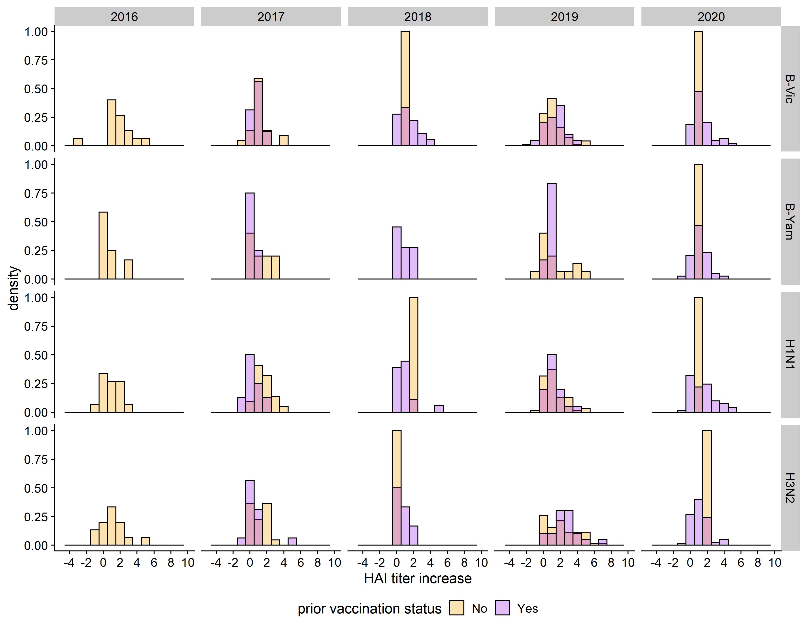
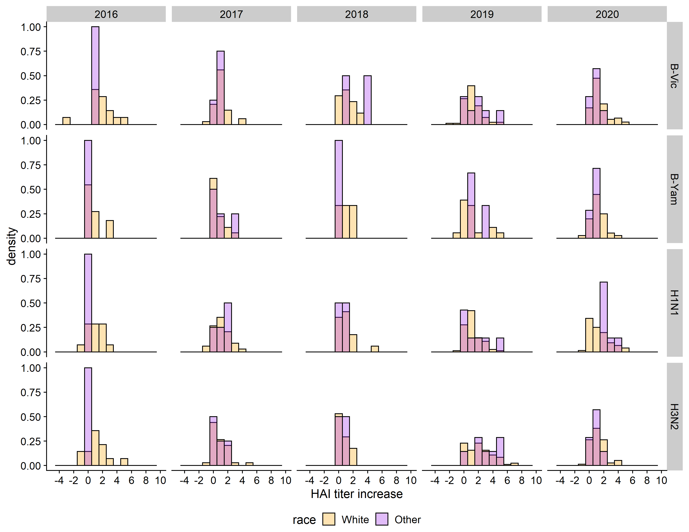
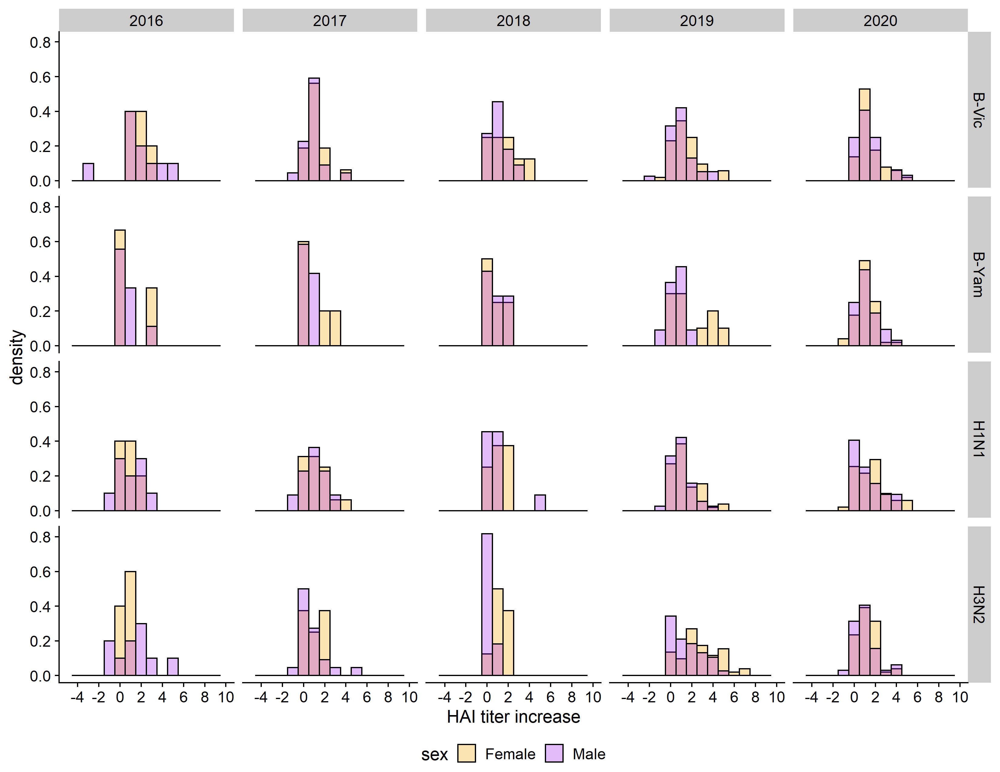

```{r setup, include = FALSE}
knitr::opts_chunk$set(echo = FALSE, message = FALSE, warning = FALSE)

# load packages
library(here)
library(gt)
library(dplyr)
library(gtsummary)

# load data
dat_clean <- readRDS(here::here("data","processed_data","clean_data.rds"))
dat_long  <- readRDS(here::here("data","processed_data","long_data.rds"))

# only patients >= 65 y.o.
dat_elderly <- dat_clean %>%
	dplyr::filter(age >= 65)
```

# Introduction

## General Background Information

While influenza has been studied for over 100 years and has caused four pandemics since 1918, the full scope of the human immune response to influenza viruses remains not fully understood. The difficulty in developing antiviral drugs and vaccines for influenza viruses is partially due to the fast rate of antigenic drift which influenza viruses display. Two major proteins for predicting pathogenicity and immunogenicity of influenza virus are the capsule surface proteins hemagglutinin (HA), which facilitates the viral entry process, and neuraminidase (NA), which facilitates the viral exit process. The genetic sequence encoding the unique properties of variants of these proteins are what give rise to the naming system of influenza A subtypes, e.g. H1N1. Hemagglutinin inhibition (HAI) titer, measured as the lowest of a series of two-fold dilutions at which hemagglutination is observed for a serum sample, is generally accepted by the influenza research community as a correlate of protection from influenza (that is, HAI titer is correlated with the strength of immune response to influenza).

Recent mechanistic modeling of the influenza immune response at the host level [@zarnitsyna_multi-epitope_2016] predicts that fold change in antibody levels after vaccination with a seasonal influenza vaccine will exhibit a negative linear relationship with preexisting antibody levels on a log-log scale, with an additional “threshold” or so-called “antigen ceiling” effect--if the host has a high-enough level of preexisting immunity, there will be no response to the influenza vaccine. This “threshold” can be overcome by increasing the dose of the vaccine.

The issue of determining individual-level drivers of the immune response to the seasonal influenza vaccine is further complicated by the rapid evolution of the influenza virus. Mutations in the influenza genome lead to the emergence of novel alleles encoding viral proteins which may or may not be recognized by the host immune system, even if a memory response exists for other strains of influenza. When the evolution of new, unrecognized antigen occurs gradually over time, this process is called "antigenic drift," and when the process occurs with a sudden, abrupt mutation leading to the emergence of a novel strain, the process is called "antigenic shift." Together, these processes lead to the spread of new influenza strains which partially or completely bypass existing host memory responses, and require the strains of influenza used in the seasonal influenza vaccine to be updated often. The lack of consistency in both circulating influenza strains and the seasonal influenza vaccine complicates the study of longitudinal response to the seasonal flu vaccine.

## Questions/Hypotheses to be addressed

To that end, we propose the following research question.
Does vaccine dose modify the effect of pre-existing immunity on immune response to the seasonal influenza vaccine?

We hypothesize that dose does modify this relationship, but there are likely interactions with other host covariates, such as age or influenza subtype imprinting probability [@arevalo_earliest_2020], so this relationship is likely not as simple as it appears in the mechanistic models.


# Methods

## Data acquisition

The data we will use for this project is from an ongoing cohort study of immune response to the seasonal influenza vaccine conducted by Ted Ross at the School of Veterinary Medicine at the University of Georgia. The study design is a prospective, open cohort where a few hundred participants receive either the FluZone, FluZone HD, or FluMist seasonal influenza vaccine each year since 2014. (Data were collected at the University of Georgia from 2016 onward.) Patients receive a pre-vaccination and a 28-day vaccination blood draw. Hemagglutination inhibition titers are conducted on serum samples for both the homologous strains of influenza included in the vaccine, as well as a wide panel of historical strains. Influenza A strains which are included are from both H1N1 and H3N2 subtypes, and influenza B strains tested against include pre-divergence historical strains, as well as strains from both the Victoria-like and Yamagata-like lineages. Several other host factors including age, sex, BMI, history of vaccine and comorbidities were also collected. The study design and assay collection methods have been described previously [@ross_influence_2014].

The data is provided to the Handel research group through UGA’s CIVR-HRP site, a division of the NIH CIVICs program, and will be accessible by both of us. The data has been partially cleaned already, but is continually in a process of wrangling and refinement, and addressing our specific question will likely involve further cleaning and reshaping of the data. All data are available in a private GitHub repository, but we hope to obtain permission from the Ross group to post a subset of the data publicly as part of the project and the paper which we hope will result from the project.

## Statistical methods

In order to examine the difference between standard dose (SD) and high dose (HD) vaccines, we excluded all participants from the study under 65 years of age, as only adults aged 65 or older were eligible to receive the high dose vaccine. We additionally only used data from the 2016-2017 influenza season onward, as these data were collected at UGA under a new data collection protocol which included more information of interest to the analysis, namely date of vaccination and patient BMI.

The primary outcome in the analysis will be strength of the homologous immune response to the vaccine. We also wish to consider breadth of response to heterologous test strains.

Several techniques could be used to analyze this relationship, such as: methods based on the linear model, such as linear mixed effects models, generalized additive (potentially mixed) models, and (potentially adaptive or relaxed) elastic net regression; several tree-based models, such as simple CART models, random forests, and gradient-boosted trees; $k$ nearest neighbors for regression; and advanced "black box" regression methods such as support vector machines (SVMs) and artificial neural networks (aNNs), although there is likely not enough data for these methods to be effective.

<!--
However, we hypothesize that this relationship is causal, so prediction algorithms may not be the best fit here. While advanced causal analyses are potentially outside the scope of this analysis, we propose to use generalized linear mixed-effects models (GLMMs), potentially in a Bayesian framework, in order to gain insight about effects on influenza vaccine response.
-->

# Results

The results are broken into the following sections.
* Exploratory analysis: this section contains univariate analyses of the data, as well as simple bivariate analyses of association between predictors.
* Linear models: this section explores fits of linear (mixed) models in order to better understand the relationships between the predictors.
* Predictive analysis: this section contains results from several statistical machine learning models which intend to predict vaccine titer. 

## Exploratory analysis

### Univariate distributions

Table \@ref(tab:SummaryTable) shows a summary of the host characteristics stratified by vaccine dose between 2016 and 2021.

```{r SummaryTable}
st <- readRDS(here::here("results", "tables", "summarytable.Rds"))
st
```

Additionally, \@ref(fig:CovarDist) shows the distribution of the two continuous covariates, age and BMI.

```{r CovarDist, fig.cap = "Caption"}
knitr::include_graphics(here::here("results", "figures", "covars_hist.png"))
```

And figure \@ref(tab:timeplot) shows a distribution of time since vaccination. This was quantified as the number of days from September 1st of the vaccine season to the vaccination date. The bin size is set to 7, so each bar represents a week of the season. Note that in the 2016-2017 flu season, the study vaccinations did not begin until January 2017.

```{r timeplot, fig.cap='Distribution of times since vaccination figure.'}

```

Table \@ref(tab:OutcomeTable) shows a summary of primary outcomes stratified by vaccine dose between 2016 and 2021.

```{r OutcomeTable, fig.cap = "Caption"}
st <- readRDS(here::here("results", "tables", "outcomestable.Rds"))
st
```

Additionally, Figure \@ref(fig:TiterDist) shows the distribution of the two continuous outcomes, titer increase and fold change.

```{r TiterDist, fig.cap = "Caption"}
knitr::include_graphics(here::here("results", "figures", "outcomes_hist.png"))
```

Figure \@ref(tab:doseplot) shows a distribution of vaccine dose.
```{r doseplot, fig.cap='Distribution of the dose figure.'}
knitr::include_graphics("../../results/figures/dose-distribution.png")
```

Figure \@ref(tab:timedoseplot) shows a distribution of times versus vaccine dose.
```{r timedoseplot, fig.cap='Distribution of times versus dose figure.'}
knitr::include_graphics("../../results/figures/time-dose.png")
```

### Bivariate associations

Now we will also examine the HAI titer increase stratified by different covariates.

Figure \@ref(tab:dosedensityplot) represents a distribution of titer increase by vaccine dose
```{r dosednsplot, fig.cap='Distribution of titer increase by vaccine dose.'}
knitr::include_graphics("../../results/figures/dose_plot.png")
```

Figure \@ref(tab:obesitydnsplot) represents a distribution of titer increase by obesity status
```{r obesitydnsplot, fig.cap='Distribution of titer increase by obesity status.'}

```

Figure \@ref(tab:priorvacdnsplot) represents a distribution of titer increase by prior vaccination
```{r priorvacdnsplot, fig.cap='Distribution of titer increase by prior vaccination.'}

```

Figure \@ref(tab:agednsplot) represents a distribution of titer increase by race
```{r agednsplot, fig.cap='Distribution of titer increase by race.'}

```

Figure \@ref(tab:sexdnsplot) represents a distribution of titer increase by sex
```{r sexdnsplot, fig.cap='Distribution of titer increase by sex.'}

```

And the same for the continuous covariates.

Figure \@ref(tab:agetiterplot) represents a distribution of titer increase by age
```{r agetiterplot, fig.cap='Distribution of titer increase by age.'}
knitr::include_graphics("../../results/figures/age_plot.png")
```

Figure \@ref(tab:bmititerplot) represents a distribution of titer increase by BMI
```{r bmititerplot, fig.cap='Distribution of titer increase by BMI.'}
knitr::include_graphics("../../results/figures/bmi_plot.png")
```

### Associations between predictors

Next we should check and see if there are bivariate associations between any of the predictors/covariates. Correlated predictors could mess up our models further along in the process, so we should check.

[ADD CORRELATION MATRIX? Spearman rho / Cramer's V / point biserial]

## Linear models

In the next section of the analysis, we will fit several linear models to attempt to find relationships that may be predictive for the homologous titer increase.

### Single-covariate (unadjusted models)

Table \@ref(tab:UniTab) shows the results of the single-predictor regression models. The outcome in each model was the fold change in HAI titer, and a linear model was fit with one predictor at a time. These results suggest that season, subtype, prevaccination HAI titer, participant sex, and prior year vaccination status are likely to be strongly predictive of the outcome.

```{r UniTab}
ut <- readRDS(here::here("results", "tables", "univariate_reg_tab.Rds"))
ut %>%
	modify_caption("Table of univariate regression coefficients. All coefficients were generated using a simple linear regression of the listed predictor on HAI titer fold change.") %>%
	as_gt()
```

### Models with pre-vac titer and another covariate

Since we are interested in controlling for the effect of prevaccination immunity, we also fit several models (using OLS) which predicted HAI titer increased based on prevaccination titer and another covariate, which was allowed to interact nonlinearly with prevaccination titer.

### First-order model without strain and season

We additionally fit an OLS linear model which predicted HAI titer increase based on prevaccination HAI titer, participant age, participant sex, whether the particiant is white, number of days between September 1st of the season and vaccination date, participant BMI, and participant prior year vaccination status. The coefficient plot is shown in Figure \@ref(fig:FOlmPlot).

```{r FOlmPlot, fig.cap = "Caption"}
knitr::include_graphics(here::here("results", "figures", "firstorderlmcoef.png"))
```

### Model with interactions without strain and season

In order to allow for potential nonlinear relationships, we also allowed the various covariates to interact with pre-vaccination titer. However, we assumed that the covariates do not interact with each other.

### Models with subtype

We furthermore decided to stratify the models by subtype: that is, we fit a separate model for A(H1N1), A(H3N2), B(Yamagata) and B(Victoria). The coefficient plot is shown in Figure \@ref(fig:FOlmPlotSubtype).

```{r FOlmPlotSubtype, fig.cap = "Caption"}
knitr::include_graphics(here::here("results", "figures", "firstorderlmcoef_subtype.png"))
```


### Models with season

We also wanted to incorporate the season into the model. In these simple OLS models, we assume that there is no correlation between measurements on the same individual at different seasons. This is likely to be untrue.

### Random effects???

Could consider:
* Model with random intercept
* Random coefficients model
* Model where prevactiter slope varies by individual. Probably doesn't make sense to vary covariate effects by individual.
* Allow correlation across seasons

### GAMs / GAMMs ???

Potentially allow smoothing effects for age and BMI. Could potentially allow for random smoothing of prevactiter but this is complicated and the dataset is a bit small for these kind of shenanigans. We can also leave the random effects alone and just add fixed effects with unknown smoothing functions.

## Predictive models

### Regularized linear models

#### LASSO

#### Ridge

#### Elastic net with mixture tuning

#### Relaxed/adaptive elastic net???

### Tree-based models

#### Simple regression tree

#### Fast and frugal trees???

#### Random forest

#### Gradient-boosted trees????

### kNN

### support vector machines

<!--
_Use a combination of text/tables/figures to explore and describe your data. You should produce plots or tables or other summary quantities for the most interesting/important quantities in your data. Depending on the total number of variables in your dataset, explore all or some of the others. FIgures produced here might be histograms or density plots, correlation plots, etc. Tables might summarize your data._

_Continue by creating plots or tables of the outcome(s) of interest and the predictor/exposure/input variables you are most interested in. If your dataset is small, you can do that for all variables. Plots produced here can be scatterplots, boxplots, violinplots, etc. Tables can be simple 2x2 tables or larger ones._

_To get some further insight into your data, if reasonable you could compute simple statistics (e.g. t-tests, simple regression model with 1 predictor, etc.) to look for associations between your outcome(s) and each individual predictor variable. Though note that unless you pre-specified the outcome and main exposure, any "p<0.05 means statistical significance" interpretation is not valid._
-->


## Full analysis


# Discussion

## Summary and Interpretation

## Strengths and Limitations

## Conclusions


# References


